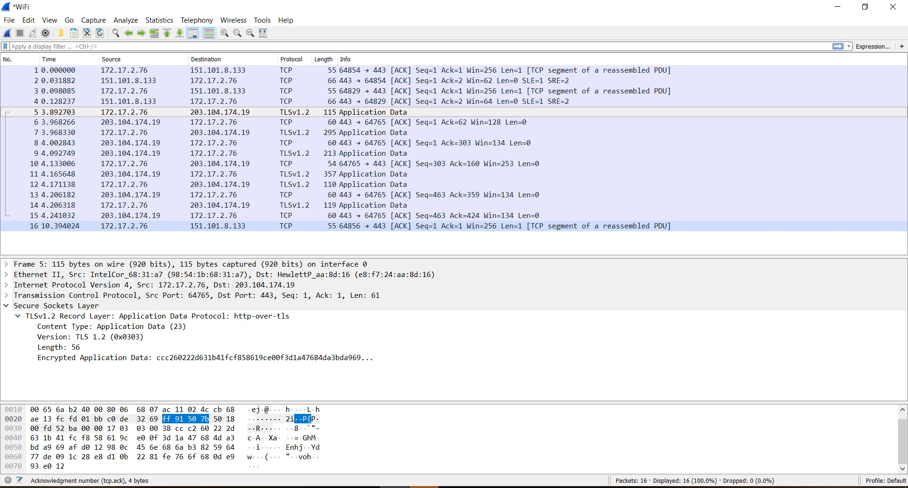

**V9.1 Communications Security Requirements**  

**TEST CASE : Communications Security with TLS **  
**1.Precondition :**  
    1. login line application in PC  
    2 open wireshark  
     
 **2.Actions :** 
    1. Run start capturing packets on wireshark 
    2. send message on Line application to another Line id 
        
  **3.Inputs :** messages  
  
  **Expected Results :**   
    
    
